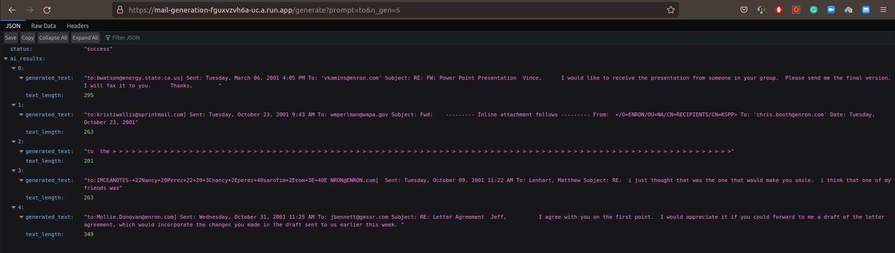
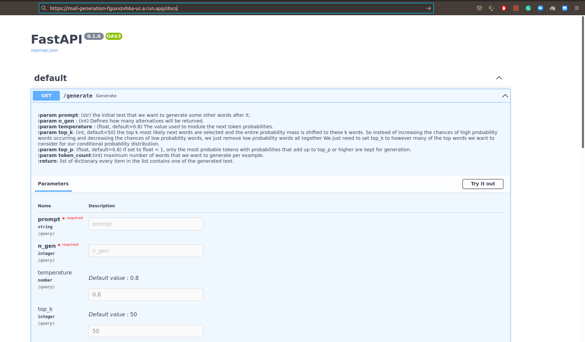

# mail-generation-service
### `/generate`
<table>
    <tr>
        <td> Description </td>
        <td> generate mails samples from AI language model.</td>
    </tr>
    <tr>
        <td> Method </td>
        <td> <code>GET</code> </td>
    </tr>
    <tr>
        <td> URL/Data Parameters </td>
        <td>
            <table>
                <tr>
                    <td> <strong><code>prompt</code></strong> </td>
                    <td> <i>str, required</i> </td>
                    <td> the initial text that we want to generate some other words after it.</td>
                </tr>
                 <tr>
                    <td> <strong><code>n_gen</code></strong> </td>
                    <td> <i>int, required</i> </td>
                    <td>Defines how many alternatives will be returned.</td>
                </tr>
                <tr>
                    <td> <strong><code>temperature</code></strong> </td>
                    <td> <i>float, non-required default: 0.8</i> </td>
                    <td> The value used to module the next token probabilities.</td>
                </tr>
                <tr>
                    <td> <strong><code>top_k</code></strong> </td>
                    <td> <i>int, non-required default: 50</i> </td>
                    <td> the top k most likely next words are selected and <br>
                            the entire probability mass is shifted to these k<br>
                            words.
                            So instead of increasing the chances of high<br> probability words 
                            occurring and<br> decreasing the chances of low probability words, <br>
                            we just remove low <br>probability words all together We just need <br>
                            to set top_k to however many of the top words we want to consider <br>
                            for our conditional probability distribution.</td>
                </tr>
                <tr>
                    <td> <strong><code>top_p</code></strong> </td>
                    <td> <i>float, non-required default: 0.8</i> </td>
                    <td> If set to float < 1, only the most probable tokens with probabilities that add up to top_p or higher are kept for generation.</td>
                </tr>
                <tr>
                    <td> <strong><code>token_count</code></strong> </td>
                    <td> <i>int, non-required default: 100</i> </td>
                    <td> maximum number of words that we want to generate per example.</td>
                </tr>
            </table>
        </td>
    </tr>
    <tr>
        <td> Success Response </td>
        <td> 
             <i><strong>Code</strong></i>: 200 OK <br>
             <i><strong>Type</strong></i>: JSON <br>
             <i><strong>Content</strong></i>:
             <pre>
{
   "status": "success",
    "ai_results": [{"generated_text": "generated text","text_length": 753}]
}
             </pre>
        </td>
    </tr>
    <tr>
        <td> Error Response </td>
        <td>
        <i><strong>Code</strong></i>: 400 Bad Request | 500 Internal Server Error <br>
        <i><strong>Type</strong></i>: JSON <br>
        <i><strong>Content</strong></i>:
        <pre>
{
    "status": "FAIL",
    "error": "::string"
}
        </pre>
        </td>
    </tr>
</table>

# run the deployed service in the browser
```
open your browser chrome or firefox
write in the url bar:
https://mail-generation-fguxvzvh6a-uc.a.run.app/generate?prompt=to&n_gen=3
```


# run swagger documentation of the deployed service
```
open your browser chrome or firefox
write in the url bar:
https://mail-generation-fguxvzvh6a-uc.a.run.app/docs
```


# run the service locally
```
run in the terminal
git clone https://github.com/zaghlol94/mail-generation-service.git
cd mail-generation-service
eport $PORT=5000
sudo docker build -t email .
sudo docker run -p 5000:5000 email
open browser and write in the url:
http://0.0.0.0:5000/generate?prompt=to&n_gen=3
or
http://0.0.0.0:5000/docs
```
